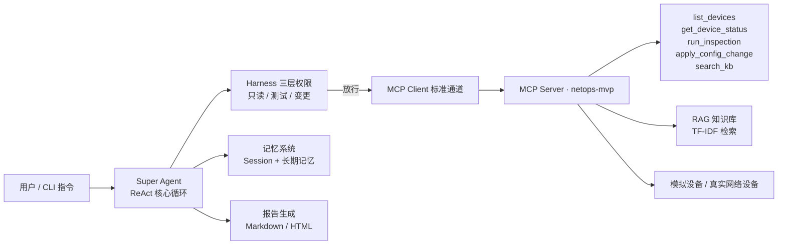

# netops-mvp · 最小网络运维 Agent

> 一套**零配置即可跑通**的网络运维 Agent 最小实现，把「大模型 + ReAct 循环 + MCP 协议 + RAG 知识库 + Harness 三层权限」落成一个可直接运行、可接入真实环境的最小系统。

适用于网络工程师 / 运维工程师快速体验 AI Agent 如何接入网络运维场景；也适合作为学习「Agent 工程化落地」的起点项目。

---

## ✨ 功能特性

- **ReAct 核心循环**：Agent 自主「思考 → 调用工具 → 观察 → 再思考」，直到任务完成
- **MCP 标准协议**：Agent 通过官方 MCP SDK（v2）的 Client ↔ Server 标准通道调用网络工具，而非直接调用函数
- **Harness 三层权限**：只读（自主执行）/ 测试（人工确认）/ 配置变更（严格审批），全量审计日志
- **RAG 知识库**：知识外置 + TF-IDF 检索，`knowledge/` 目录放文档即自动建索引，检索结果带来源溯源
- **记忆系统**：Session 短时上下文 + 长期记忆（跨会话记住设备状态）
- **结构化报告**：自动导出 Markdown / HTML 巡检报告
- **零配置可跑**：无 API Key 时自动降级为规则引擎，开箱即可端到端演示
- **可升级真实环境**：接入任一 OpenAI 兼容大模型 + netmiko 连接真实设备即可生产化

---

## 🧭 工作原理



一次「全网巡检」任务的完整闭环：

```
列设备 → 逐台查状态 → 发现接口 down → 检索 RAG 排障知识
→ ping 测试（人工确认）→ 应用配置变更（人工审批）→ 复核状态 → 生成报告
```

---

## 🚀 快速开始

要求：Python 3.10+。

```bash
# 1. 克隆 / 进入项目
git clone https://github.com/munk88/netops.git
cd netops

# 2. 创建虚拟环境并安装依赖
python3 -m venv .venv
./.venv/bin/pip install -r requirements.txt

# 3. 一键端到端演示（无需任何 API Key）
./.venv/bin/python demo.py
```

> demo 会走完「全网巡检 → 排障 → 恢复 → 生成报告」的完整流程，并展示每一步的 Harness 权限裁决与审计记录。

---

## 💬 交互式使用

```bash
./.venv/bin/python cli.py
```

进入对话后输入自然语言指令，例如：

| 指令 | 触发行为 |
|---|---|
| `全网巡检并生成报告` | 列出设备 → 逐台查状态 → 发现故障 → 排障 → 生成报告 |
| `ping 测试 R2` | 对 R2 执行连通性测试（测试类，需确认） |
| `接口 down 怎么排障` | 检索 RAG 知识库获取排障步骤 |
| `恢复 R2 接口配置` | 应用配置变更（高风险，需审批） |
| `quit` / `exit` | 退出 |

### CLI 参数

```bash
# 单条指令执行后退出（适合脚本调用）
./.venv/bin/python cli.py --once "全网巡检并生成报告"

# 每次回答后生成 report.md / report.html 到 reports/
./.venv/bin/python cli.py --report

# 配置变更自动批准（仅演示用，生产勿开）
./.venv/bin/python cli.py --approve-change
```

> 交互模式下，测试操作会询问 `[y/N]`，配置变更要求输入 `APPROVE` 才执行；非交互模式（管道/`--once`）会自动确认并给出告警提示。

---

## 📚 知识库（RAG，知识外置）

知识库**不写在代码里**：把运维文档放进 `knowledge/` 目录（`.md` / `.txt` / `.rst`，支持子目录），Agent 启动即自动建索引，`search_kb` 工具即可检索到，检索结果带「来源文件名」溯源。

```bash
# 查看知识库状态（模式 / 知识块数 / 来源文件）
./.venv/bin/python -m netops_agent.rag --status

# 放新文档后重建索引（服务运行中也会自动检测目录变化）
./.venv/bin/python -m netops_agent.rag --rebuild

# 检索测试
./.venv/bin/python -m netops_agent.rag --query "BGP 邻居起不来"
```

示例：`knowledge/` 已内置 7 份排障文档（接口 down / 端口安全 / OSPF / BGP / 巡检命令 / CPU / 固件升级）。目录为空时自动回退到内置示例知识。检索实现目前为 TF-IDF（零重依赖），`search(query, top_k)` 接口与真实向量库对齐，可无缝升级为 embedding + 向量库。

---

## 🖥️ Web 控制台（推荐，含前端页面）

本地启动一个带前端页面的可视化控制台，浏览器即可操作：

```bash
./.venv/bin/python webapp.py
```

然后打开 **http://127.0.0.1:8000**。

页面提供：

- **对话指令**：像聊天一样下运维指令（支持快捷指令 chips）
- **实时执行轨迹**：SSE 流式展示 Agent 每一步（工具调用 / 参数 / Harness 权限裁决 / 观察结果）
- **Harness 确认弹窗**：测试与配置变更直接在页面上「批准 / 拒绝」，不用敲命令行
- **设备状态仪表盘**：R1 / R2 / SW1 三台设备的 CPU、内存、接口实时刷新
- **巡检报告**：运行「全网巡检并生成报告」后自动展示 Markdown 报告，可一键打开 HTML 版

技术栈：FastAPI + SSE（后端）＋原生 HTML/CSS/JS（前端，零构建），完全本地运行、无需部署联网。

---

## 📄 报告输出

运行后生成到 `reports/`：

- `report.md` —— Markdown 版本
- `report.html` —— HTML 版本（浏览器直接打开）

报告包含：生成时间、完整执行轨迹（每次工具调用、参数、观察结果、权限裁决）、最终结论。

---

## 🔌 接入真实大模型（可选）

编辑 `config.json`，填入任一 **OpenAI 兼容** 服务的参数即可：

```json
{
  "provider": "openai_compatible",
  "base_url": "https://api.deepseek.com/v1",
  "api_key": "sk-xxxx",
  "model": "deepseek-chat",
  "temperature": 0.3,
  "timeout": 60
}
```

| 服务 | base_url | model 示例 |
|---|---|---|
| DeepSeek | `https://api.deepseek.com/v1` | `deepseek-chat` |
| OpenAI | `https://api.openai.com/v1` | `gpt-4o-mini` |
| 豆包 / 火山方舟 | 方舟兼容地址 | 你的模型名 |
| 本地 Ollama | `http://localhost:11434/v1` | `qwen2.5:7b`（需设 `provider: ollama`） |

> 接入真实大模型后，Agent 由「规则引擎」升级为真正的 LLM 推理循环，MCP 工具管道不变。

---

## 🌐 接入真实网络设备（可选）

`netops_agent/device.py` 当前为**模拟设备**（内置 R1 / R2 / SW1 三台）。接入真实设备只需把工具内部的 `dev.*` 调用替换为 netmiko/SSH 读写，例如：

```python
from netmiko import ConnectHandler

conn = ConnectHandler(
    device_type="huawei",
    ip="10.0.0.1",
    username="admin",
    password="****",
)

# 只读操作
conn.send_command("display interface brief")

# 配置变更
conn.send_config_set(["interface GE0/0/0", "shutdown", "no shutdown"])
```

---

## 🛡️ 安全设计（Harness 三层权限）

| 层级 | 示例 | 执行方式 |
|---|---|---|
| 只读分析 | 读日志 / 查状态 / 检索知识库 | Agent 自主执行 |
| 测试与采集 | ping / 连通性验证 | 人工确认后执行 |
| 配置变更 | 改参数 / 复位接口 / 升级固件 | 严格审批，禁止自主 |

落地机制：

- 每个工具声明权限级别，调用前必经 `harness.check()` 裁决
- 配置变更默认要求显式批准（交互输入 `APPROVE`）
- 全量审计日志写入 `audit.jsonl`（时间 / 工具 / 参数 / 裁决）
- 接入真实设备后，建议只读用只读账号、变更走提权 + 双人复核

---

## 📁 项目结构

```
netops-mvp/
├── cli.py                 # 交互式命令行入口
├── demo.py                # 一键端到端演示
├── webapp.py              # Web 控制台后端（FastAPI + SSE）
├── config.json            # 大模型配置（留空走规则引擎）
├── requirements.txt       # 依赖（requests + mcp + fastapi + uvicorn）
├── static/                # Web 控制台前端（index.html / style.css / app.js）
├── knowledge/             # 运维知识库文档（.md/.txt，可自行增删）
├── netops_agent/
│   ├── __init__.py
│   ├── agent.py           # ReAct 核心循环（思考→裁决→MCP调用→观察）
│   ├── llm.py             # LLM 客户端（OpenAI 兼容）+ 规则降级引擎
│   ├── mcp_tools.py       # MCP Server + 网络运维工具封装
│   ├── harness.py         # Harness 三层权限 + 审计日志（同步/异步双裁决）
│   ├── rag.py             # 最小 RAG（切块 + TF-IDF 检索）
│   ├── memory.py          # Session + 长期记忆
│   ├── device.py          # 模拟设备（可替换为 netmiko）
│   └── report.py          # Markdown / HTML 报告生成
├── reports/               # 生成的报告（git 忽略）
├── audit.jsonl            # Harness 审计日志（git 忽略）
└── memory.json            # 长期记忆（git 忽略）
```

---

## ❓ 常见问题

**没有 API Key 能跑吗？**
能。未配置 `config.json` 时自动使用内置规则引擎，完整演示管道，零密钥可跑。

**MCP 用的是什么版本？**
官方 `mcp>=2.0` SDK（即 2026 年无状态大改版后的新架构，`MCPServer` + `Client`）。

**RAG 为什么用 TF-IDF 而不是向量库？**
MVP 为保持零重依赖用纯 Python 实现；`rag.py` 的 `search()` 接口与真实 embedding + 向量库对齐，可直接替换。

**如何恢复模拟设备的初始状态？**
`device.py` 提供 `reset()`；或直接删除运行产物 `audit.jsonl`、`memory.json`、`reports/` 后重新运行 demo。

**怎么往知识库里加自己的运维文档？**
把 `.md` / `.txt` 文档放进 `knowledge/` 目录（可建子目录），运行 `./.venv/bin/python -m netops_agent.rag --rebuild` 重建索引即可；运行中的 Web 服务也会在下一次检索时自动检测目录变化并重建。

---

## 📄 License

MIT
